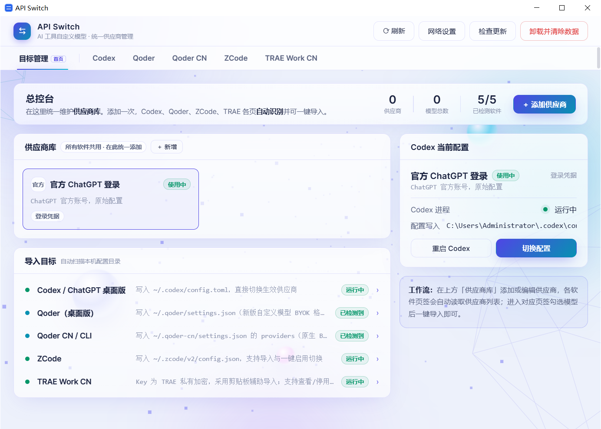
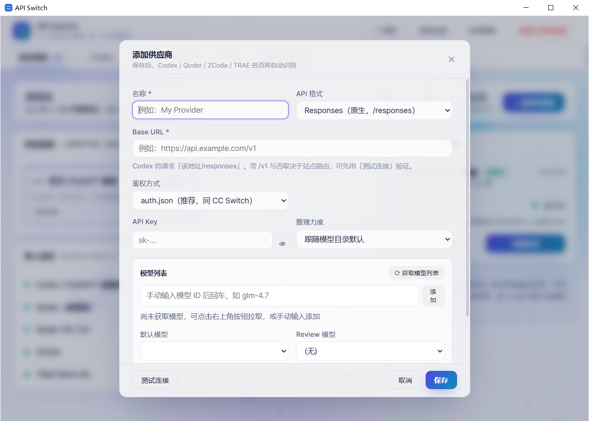
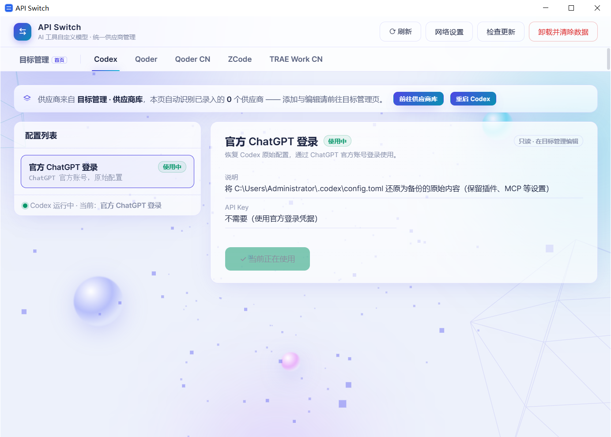

# API Switch

一个**纯本地、绿色免安装**的 Windows 桌面小工具：为 AI 编程工具（Codex / Qoder / Qoder CN / ZCode / TRAE Work CN）**一键配置与切换自定义模型供应商**（中转站 / 自建 API），省去手动改配置文件的麻烦。

## 界面预览

**目标管理（首页）**：总控制台统一管理供应商库，自动扫描各软件检测状态

**添加供应商**：一次录入，保存后 Codex / Qoder / ZCode / TRAE 各页自动识别共用

**Codex 页**：自动识别供应商库，一键切换 / 还原官方登录

## 功能一览

| 页签 | 目标软件 | 作用 |
|------|----------|------|
| Codex | ChatGPT 桌面版 / Codex CLI | 添加 / 切换 API 供应商（写入 `~/.codex/config.toml` 托管区块） |
| Qoder | Qoder 桌面版 | 一键导入自定义模型（写入 `~/.qoder/settings.json`，新版 BYOK 格式） |
| Qoder CN | Qoder CLI / Qoder CN | 写入 `~/.qoder-cn/settings.json` 的 BYOK 配置 |
| ZCode | ZCode | 导入模型并一键启用切换（写入 `~/.zcode/v2/config.json`） |
| TRAE Work CN | TRAE SOLO CN | 辅助导入（剪贴板预填）+ 已有自定义模型的启用 / 停用 / 删除管理 |
| 目标管理 | —— | 各软件检测状态与导入用法一览，新手引导入口 |

核心特性：

- **供应商库统一管理**：一次录入，所有页签共用；自带不可删除的「原始配置」，随时还原官方登录。
- **Key 安全**：API Key 用 Windows DPAPI 加密保存，只在本机可解密；`config.toml` / `auth.json` 首次修改前自动备份。
- **模型识别**：内置 models.dev 规格表 + 在线更新，自动识别各模型的上下文 / 输出上限；支持「测试连接」「获取模型列表」。
- **本地服务仅绑定 127.0.0.1**，外部无法访问；程序本身不上传任何数据。
- **一键更新**：启动时静默比对 GitHub Releases，发现新版本时右上角出现提示按钮；点击后自动下载、SHA-256 校验、覆盖安装并重启，配置保留（这是唯一的联网检查，且只访问 GitHub API）。

## 下载与使用

1. 到 [Releases](../../releases) 下载最新版 `APISwitch-vX.Y.Z.exe`（下载后可随意重命名）；
2. 双击运行即可（无需安装、无需管理员权限；首次运行如被 Windows SmartScreen 拦截，选择「仍要运行」）；
3. 详细说明见 [docs/使用说明.md](docs/使用说明.md)。

## 更新机制

工具内置一键更新：打开后自动向 GitHub Releases API 查询最新版本号，也可随时点右上角「检查更新」手动检查；发现更新时显示「发现新版本 vX.Y.Z」按钮，点击后自动下载新版本、SHA-256 校验、覆盖安装并重启，供应商配置全部保留。发布者只需打 tag、上传 exe 即可发布新版本，流程见 [tools/README.md](tools/README.md)。

## 卸载

点右上角「**卸载并清除数据**」（「检查更新」按钮右侧）：会自动还原 Codex 原始配置（用首次修改前的备份覆盖回），并删除本工具全部数据（供应商库与其中加密保存的 API Key）。最后手动删除 exe 文件即完成卸载。已导入到 Qoder / ZCode / TRAE 的模型属于各软件自己的配置，不会被动到，需在对应软件内删除。

## 许可

[MIT](LICENSE) © han5627826
